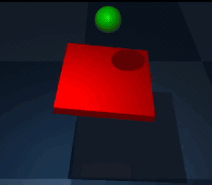
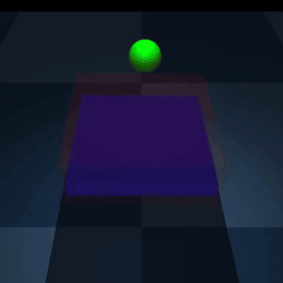
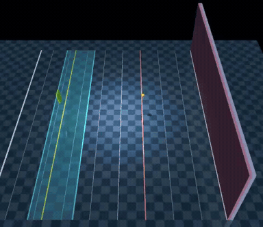

# Courtside Dynamics

[](https://github.com/kuds/courtside-dynamics/actions/workflows/ci.yml)

Courtside Dynamics is a progression of MuJoCo environments and deep
reinforcement-learning tools aimed at one long-term goal: **teach humanoid
agents to rally and play tennis**.

The project moves from simple ball control to racket-and-wall tasks and an
experimental two-humanoid tennis curriculum. Full learned humanoid tennis has
not yet been demonstrated.

## Installation

Courtside Dynamics supports Python 3.11 through 3.13.

```bash
git clone https://github.com/kuds/courtside-dynamics.git
cd courtside-dynamics
pip install -e ".[train]"
```

### Optional dependencies

- Base installation provides MuJoCo, Gymnasium, NumPy, ImageIO, and Packaging.
- `train` adds SB3, PyTorch, TensorBoard, pandas, Matplotlib, and MoviePy.
- `notebooks` adds MediaPy but intentionally does not install Jupyter. Colab
  provides and pins its own Jupyter server; install Jupyter or JupyterLab
  separately for a fresh local environment.
- `dev` adds pytest, pytest-timeout, Ruff, and mypy.

For training and notebooks together, run
`pip install -e ".[train,notebooks]"`.

## Quick start

Create a registered Gymnasium environment:

```python
import gymnasium as gym
import courtside_dynamics  # Registers the environments.

env = gym.make("CourtsideDynamics/BallBounce")
observation, info = env.reset(seed=0)
observation, reward, terminated, truncated, info = env.step(
    env.action_space.sample()
)
env.close()
```

Train from a curated Stable-Baselines3 (SB3) recipe:

```python
from courtside_dynamics.recipes import build_train_config
from courtside_dynamics.training import train

config = build_train_config(
    "WallBall",
    algo="SAC",
    log_dir="./logs/WallBall",
    quick_test=True,
    seed=0,
)
model = train(config)
```

`quick_test=True` runs a short pipeline check. Remove it to use the recipe's
full training budget. `seed=0` seeds SB3, workers, and helper environments;
exact results can still vary across hardware and runtime stacks.

## Environments

| Environment ID | Task | Status |
|---|---|---|
| `CourtsideDynamics/BallBalance` | Keep a ball on a 6-DoF tray. | Available |
| `CourtsideDynamics/BallBounce` | Deliberately rebound a ball from a 6-DoF paddle's top face. | Available |
| `CourtsideDynamics/WallBall` | Rally against a wall with a face-only paddle at a fixed 10° upward pitch, three target-controlled DoFs, and gated rewards. | Available |
| `CourtsideDynamics/HumanoidTennisCoop` | Control two simulated Unitree G1 humanoids through one policy. | Available (experimental; free-standing default) |

Starting with package version 0.6.0, registered environment IDs are
unversioned. Callers using the previous version suffixes should use the IDs in
the table.

Package version 0.7.0 corrects BallBounce's rotation units and actuator
authority and replaces control-boundary touch rewards with substep-resolved,
top-face rebound events. Earlier BallBounce policies and learning curves are
not comparable and should be retrained; the observation grows from 18 to 30
values to include ball spin and the event detector's Markov state. Its training
recipe reports success after ten deliberate rebounds in one episode; passive
paddle contacts do not increment that metric.

Package version 0.8.0 simplifies WallBall to the paddle face alone at a fixed
10° upward pitch. Its three `[-1, 1]` actions are absolute x/y/z position
targets tracked by force-limited servos, and its observation shrinks from 26
to 22 values after removing yaw/pitch state. Previous WallBall models,
`VecNormalize` statistics, replay buffers, and raw MuJoCo states are
incompatible; start a fresh run rather than resuming a pre-0.8 artifact. The
Wall Ball animation below was recorded with the legacy 5-action environment.

Package version 0.9.0 adds recovery-focused training to the strict baseline
style. WallBall supports fixed per-run rally styles while keeping the same
3-action interface. `WallBallVolley` forbids floor
contacts. `WallBallBaseline` requires exactly one bounce before each paddle
return, starts the paddle farther back at world x=-2.7, restricts it to the
[-3.2, -2.1] baseline lane, and uses a calibrated lower serve. Its training
factory mixes normal serves with incoming-wall and post-bounce recovery
fragments, then tapers that practice using global training steps. Checkpoint
evaluation, videos, and post-training endurance scoring always start from a
normal serve. A one-bit recoverability flag expands WallBall observations to
23 values, so all 0.8 `WallBall`, `WallBallVolley`, and `WallBallBaseline`
policies and `VecNormalize` statistics require a fresh run. The original
`WallBall` recipe remains the permissive `open` setup; train separate policies
for the strict volley and baseline recipes.

| Ball Balance | Ball Bounce | Wall Ball |
|:---:|:---:|:---:|
|  |  |  |

`HumanoidTennisCoop` exposes a centralized single-agent Gymnasium interface:
one policy controls both players. It is compatible with the shared SB3
pipeline and is not a PettingZoo multi-agent environment.

## Training

### Recipes

Recipes hold each task's constructor settings, algorithm defaults, training
budget, evaluation metric, recording schema, and artifact schedule. The
available recipe keys are:

- `BallBalance`
- `BallBounce`
- `WallBall`
- `WallBallVolley`
- `WallBallBaseline`
- `HumanoidTennisStage0Intercept`
- `HumanoidTennisStage1AnchoredReturn`
- `HumanoidTennisStage2RandomizedReturn`
- `HumanoidTennisCoopSmoke`

The three fixed-stage humanoid recipes are experimental PPO starting points,
not evidence of learned convergence. SAC remains selectable, but its entropy
tuner sees all 58 action dimensions and is not mask-aware; PPO also spends
exploration on inactive coordinates. `HumanoidTennisCoopSmoke` is a 10,000-step
integration and recording check, not a learning baseline.

For full control, construct `TrainConfig` directly:

```python
from courtside_dynamics.envs import BallBounceEnv
from courtside_dynamics.training import TrainConfig, train

config = TrainConfig(
    env_fn=lambda: BallBounceEnv(render_mode="rgb_array", min_force=100.0),
    algo="SAC",
    total_timesteps=1_500_000,
    log_dir="./logs/BallBounce",
    name_prefix="ball_bounce",
)
model = train(config)
```

### Notebooks

- [`notebooks/sb3_training.ipynb`](notebooks/sb3_training.ipynb) is the generic
  Colab driver for every recipe.
- [`notebooks/humanoid_tennis_training.ipynb`](notebooks/humanoid_tennis_training.ipynb)
  runs the gated Stage 0–2 PPO transfer curriculum.

The humanoid notebook advances after a passing canonical evaluation. It
warm-starts the next stage from the passing policy and its matching observation
normalizer, while starting with a fresh optimizer and reward-normalization
state. Reward, episode length, rally count, and return counts remain diagnostics
unless the notebook user enables them as additional criteria.

## Humanoid tennis status

The implemented system includes a regulation court, physical tennis ball and
net, two simulated 29-DoF Unitree G1 humanoids, rigid right-wrist rackets,
ordered MuJoCo contact events, and a deterministic rally state machine.

Serve/feed sides alternate unless explicitly overridden. The default
free-standing mode uses bounded seeded launch noise near the baseline; Stages
0–1 use deterministic mirrored anchored feeds, and Stage 2 randomizes that
anchored launch. Reset and step `info` retain the serve side and full initial
ball `qpos`/`qvel` for recording.

### Curriculum stages

| Stage | Task | Controls and availability |
|---|---|---|
| 0 | Fixed-pelvis intercept of a slow physical feed | Returning player's shoulder pitch/roll; environment and recipe available |
| 1 | Anchored right-arm return into a generous target | Returning player's seven right-arm controls; environment and recipe available |
| 2 | Anchored target return with bounded launch randomization | Same right-arm controls; environment and recipe available |
| 3–5 | Standing, mobile-partner, and two-learned-player milestones | Planned; selecting them raises `NotImplementedError` |
| 6 | Two free-standing players | Environment mode available; no validated training recipe |

For Stages 0–2, the learned returner is the non-serving side and alternates as
feed sides alternate. Physical weld constraints hold both pelvises, inactive
joints receive standing-reference PD targets, and early contact forgiveness
changes only the massless stringbed dimensions. Curriculum settings remain
fixed for an environment instance; reset-time stage mixing would be partially
observed and is intentionally unsupported.

### API contract

The centralized API keeps the same 58 actions and 299 observations across all
available modes. A zero action is the two-player standing-reference PD hold.

| Action slice | Controls |
|---|---|
| `[0:29]` | Player A |
| `[29:58]` | Player B |
| `[22:29]` | Player A right arm and racket |
| `[51:58]` | Player B right arm and racket |

The action mask is all ones in free-standing mode and selects only the learned
controls in constrained stages. Stage 0 activates `[22:24]` for player A or
`[51:53]` for player B; Stages 1–2 activate the corresponding seven-value
right-arm slice.

| Observation slice | Contents |
|---|---|
| `[0:71]` | Player A proprioception |
| `[71:142]` | Player B proprioception |
| `[142:157]` | Physical racket A |
| `[157:172]` | Physical racket B |
| `[172:181]` | Ball position, velocity, and spin |
| `[181:193]` | Ball-relative coordinates |
| `[193:221]` | Rally state |
| `[221:231]` | Contact-latch state |
| `[231:241]` | Contact-release progress |
| `[241:299]` | Active-action mask |

Humanoid recipes normalize continuous physical observations at indices
`0–192` and leave the bounded rally, contact, and action-mask tail at
`193–298` raw. This prevents newly active curriculum flags from inheriting
near-zero variance when a normalizer transfers between stages.

### Rules, rewards, and validation

The rule reducer confirms a legal return only after the ball crosses the net
and is then volleyed or lands in bounds. It suppresses duplicate contact
episodes and reports explicit fault reasons for double bounces, out balls,
illegal hits, net contacts, and unsafe simulation.

With the default reward configuration, an ordinary fault pays `-1` and unsafe
or non-finite physics pays `-2`. In non-curriculum mode, a confirmed legal
return pays `+1`; survival, feed crossings, first bounces, and unconfirmed
racket taps pay zero. The canonical curriculum presets instead award `+1` for
Stage 0's first valid learned-player racket hit or Stages 1–2's valid target
return. Optional hit shaping is escrowed and clawed back when the return fails.

The scripted full-tennis, Stage 0, and Stage 1 oracles validate physical
feasibility and mirrored rule behavior. They are test fixtures, not evidence of
learned policies; the Stage 1 oracle is deliberately timing-sensitive.

## Humanoid curriculum evaluation and promotion

`evaluate_curriculum_stage` evaluates a fixed-stage environment and records
the policy, checkpoint, normalizer, package source, Git revision, suite, and
runtime identities. `assess_curriculum_promotion` then applies an advisory
gate:

- 50 seeded launches mirrored across both court orientations, producing 100
  episodes and 100 unique physical initial states;
- at least 80% success overall and on each serving-side orientation for the
  current stage, and at least 75% overall and per side on every implemented
  predecessor;
- zero unsafe episodes by default;
- canonical preset, recipe horizon, rule/contact settings, and held-out suite;
- fresh evidence from the same policy and normalizer for every earlier stage.

Normalized policies must provide the exact frozen `VecNormalize` artifact used
with the checkpoint. Easier custom variants remain useful experiments but are
not promotion-eligible. The evaluator rolls out and closes fresh environment
instances; neither helper changes curriculum configuration, checkpoints,
recipes, training runs, or promotion state. The dedicated curriculum notebook
consumes the report to advance automatically. Replay-buffer migration and mixed
prior-stage rehearsal are not implemented.

## Training artifacts and diagnostics

Completed runs and runs orderly salvaged after `KeyboardInterrupt` capture the
configuration and diagnostic evidence needed to investigate training. Some
artifacts appear only when their corresponding callback fires or feature is
enabled.

| Artifact | Contents |
|---|---|
| `config.json` | Serializable training settings, environment class/space/curriculum metadata, selected resolved SB3 settings, versions, device, Git SHA, and warm-start identities |
| `stage_summary.txt` | Final evaluation and, when scheduled evaluation ran, best evaluation, plus duration, throughput, device, and final training-health metrics |
| `evaluations.npz` | Evaluation reward history when scheduled evaluation runs |
| `eval_info.csv` | Aggregated info metrics when info-dictionary evaluation is enabled and runs |
| `tensorboard/`, `tensorboard/progress.csv` | Live training scalars and their CSV mirror |
| `monitor/`, `checkpoints/`, `videos/` | Episode returns and optional snapshots or rollout recordings |
| `best_model.zip`, `best_vec_normalize.pkl` | Best checkpoint after evaluation and, when normalization is enabled, its matching statistics |

`courtside_dynamics.notebook_utils` can replay the stage summary, audit a run
directory, explain missing optional artifacts, and plot learning, evaluation,
and training-health CSVs. The notebooks run these diagnostics after training.

## Development

Install the development and training dependencies, then run the checks:

```bash
pip install -e ".[train,dev]"
ruff check .
mypy
pytest
```

The suite covers Gymnasium registration and API invariants, MuJoCo physics and
contact semantics, rally rules, fixed-stage curriculum and promotion metrics,
SB3 training and callbacks, run artifacts, and notebook helpers. Rendering is
also smoke-tested when a display or virtual framebuffer is available.

### Repository layout

```text
courtside-dynamics/
├── pyproject.toml
├── src/courtside_dynamics/
│   ├── assets/                  # MJCF, court, racket, and robot assets
│   ├── envs/                    # Gymnasium tasks and curriculum contracts
│   ├── callbacks/               # Evaluation and video recording
│   ├── training/                # SAC/PPO training, artifacts, and promotion
│   ├── recipes.py               # Curated environment/training presets
│   ├── notebook_utils.py        # Colab setup, plots, replay, and audits
│   └── scripted_policies.py     # Deterministic validation oracles
├── notebooks/
└── tests/
```

## Attribution and related work

The Unitree G1 simulation assets are pinned from MuJoCo Menagerie under
BSD-3-Clause; see [`THIRD_PARTY_NOTICES.md`](THIRD_PARTY_NOTICES.md). The
physical G1 hardware is proprietary, and its inclusion does not imply Unitree
endorsement.

- [LATENT](https://zzk273.github.io/LATENT/) provides research evidence for G1
  tennis and a possible future motion-prior path; it is not a dependency of
  this project.
- [Serving Up Some Robotics: Setting Up a Tennis Environment in MuJoCo](https://www.findingtheta.com/blog/serving-up-some-robotics-setting-up-a-tennis-environment-in-mujoco)
